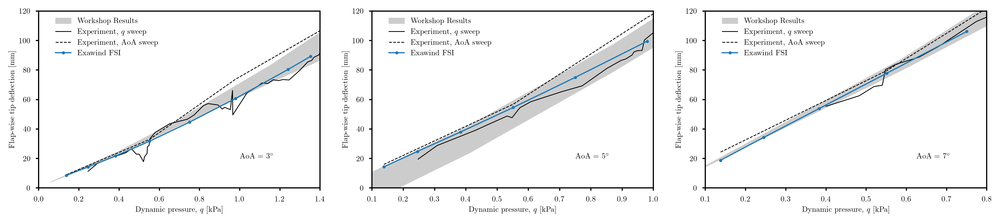
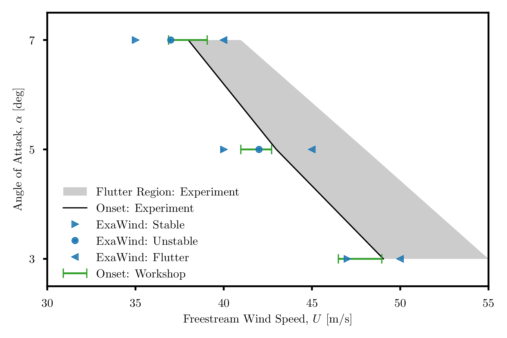
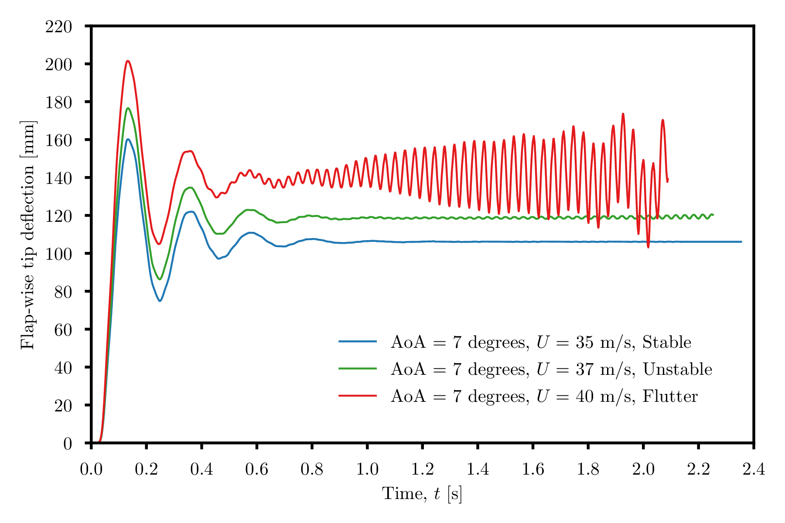

# Pazy Wing Aeroelastic Validation Case

This benchmark contains a blade-resolved model of the Pazy Wing [1] aeroelastic case in uniform flow.  A range of freestream velocities is used to assess the pre-flutter static deflection and flutter onset boundaries.  Both wind-tunnel data [1] and simulation results [2] are used for comparison.

**Contents**

- [Simulation Description and Setup](#simulation-description-and-setup)
- [Postprocessing](#postprocessing)
- [Code Performance](#code-performance)
- [Results](#results)

## Simulation Description and Setup

The geometry and flow conditions of the Pazy Wing case are defined in Avin et al. [1]  They are summarized in the following table.

| Case Property     | Value                  |
| :---              | ---                    |
| Span              | 0.55 m                 |
| Chord             | 0.10 m                 |
| Airfoil           | NACA0018               |
| Angle of Attack   | 3-7 deg                |
| Density           | 1.225 kg/m3 |
| Dynamic Viscosity | 1.88E-05 Pa-s          |
| Velocity          | 15-50 m/s              |
| Mach Number       | 0.04-0.15              |
| Reynolds Number   | < 3.4E+05              |
| Turbulence Level  | 0.5%                   |

Note that the wind-tunnel model given in [1] has several small unintentional features, including varying airfoil thickness along the span, sag in the flap-wise direction, and twist (about 1 degree).  It is assumed here that these features have a negligible impact on the FSI results, and an idealized version of the wing is used instead, with a uniform cross-section along the span.

**Domain Overview**

The CFD computational domain consists of an inner Nalu-Wind domain immediately surrounding the wing, and an outer AMR-Wind domain to allow space for the wake to propagate.  The sides, ceiling, and floor of the AMR-Wind domain are intended to approximate the effect of the wind tunnel walls used in the experiment.  However, to avoid the computational expense of resolving the boundary layers near the tunnel walls, *slip wall* boundaries are used there.  The Nalu-Wind domain extends a few chord-lengths away from the wing, and terminates with an *overset* boundary on the exterior, and a *slip wall* on the portion that touches the bottom wind tunnel boundary.  The inner boundary of the Nalu-Wind domain represents the wing surface, and uses a *no-slip wall* boundary condition.

In the experiment, the blade tip passes near the wind-tunnel walls at peak deflection.  Since the Nalu-Wind domain extends several chord lengths away from the wing, the AMR-Wind domain was chosen to be somewhat larger than the wind tunnel in order to avoid collisions of the overset boundary with the slip wall at peak deflection, and additional padding was provided to ensure the results are not contaminated by the effect of the artificial slip wall boundaries.  Future studies are planned to investigate the impact of the choice of AMR-Wind domain size on the simulation results.

**Code Versions**

While we expect that using the current release of each code will produce comparable results, the specific versions of each code that were used to generate the results in this document are given below for completeness.

- ExaWind driver: [``a38a4d5f96e4d3b42b52f41280e2d8d28c57ef25``]( https://github.com/Exawind/exawind-driver/commit/a38a4d5f96e4d3b42b52f41280e2d8d28c57ef25)
- Nalu-Wind:  &ensp;&ensp;&nbsp;&nbsp;&nbsp;  [``f3cecafbdc05e61d0550ff41a30307425ef8197b``](https://github.com/Exawind/nalu-wind/commit/f3cecafbdc05e61d0550ff41a30307425ef8197b)
- AMR-Wind:   &ensp;&emsp;&nbsp; [``8bad127f62cf2fd2f0d0ae16f2df47fdd0d069f8``]( https://github.com/Exawind/amr-wind/commit/8bad127f62cf2fd2f0d0ae16f2df47fdd0d069f8) 
- OpenFAST: &ensp;&nbsp;&nbsp;&nbsp;&nbsp;&nbsp;&nbsp;[``024dbc1816ca8caeefcc720b1099397730b1ec0a``](https://github.com/Exawind/amr-wind/commit/8bad127f62cf2fd2f0d0ae16f2df47fdd0d069f8)

## Postprocessing

## Code Performance

## Results

**Static Deflection Results**

For wind velocities below the flutter onset boundary, the wing deformation approaches a steady state after the initial oscillatory transients decay.  The final tip deflection is a function of the freestream velocity and the root angle of attack.  Comparison data is available for three angles of attack (3, 5 and 7 degrees), and wind speeds between 15 m/s and the flutter onset speed, which depends on the angle of attack.  For each AoA, comparisons are shown below.  The two black curves are experimental data from [1].  The solid black curve is from a sweep of dynamic pressure (while holding AoA constant), and the dashed black curve is from a sweep of AoA (while holding dynamic pressure constant).  The solid black line is used as the reference for comparison in [2], and we likewise treat it as the more reliable of the two experimental data sets.  The grey band indicates the spread in computational comparison data given in [2].

<!---

--->

<!---
### AoA = 5 degrees

### AoA = 7 degrees

--->

**Flutter Results**

For wind velocities above the flutter onset boundary, the wing deformation initially behaves in a similar way to the pre-flutter cases above.  However, the oscillatory transients do not decay, but instead continually grow until solver failure is reached.  The quantity of interest is the flutter onset velocity.  The results are shown below.  The next section explains how the flutter onset boundary is determined.

**Determination of Flutter Onset Boundary**

For wind speeds in the neighborhood of the flutter boundary, three possible behaviors of the tip deflection may be observed:
- The oscillatory transients decay, and approach a constant steady-state value.  We term this behavior "stable".
- The oscillations do not decay, but also do not grow without bound.  We term this behavior "unstable".
- The oscillations continue to grow without bound, leading to solver failure.  We term this behavior "flutter".

These three behaviors are demonstrated in the plot below.  For these results, we are interested in bracketing the flutter onset boundary; that is, for a given root AoA, we perform simulations at multiple velocities in the neighborhood of the flutter onset boundary, and determine two speeds that may be clearly classified as "stable" and "flutter", respectively.  We aim to bracket the flutter onset speed in this manner within 10% of the experimental value.

[1]: Avin, Or,  et al. "Experimental aeroelastic benchmark of a very flexible wing." AIAA Journal 60.3 (2022): 1745-1768.

[2]: Ritter, Markus, et al. "Collaborative Pazy wing analyses for the third aeroelastic prediction workshop." AIAA SciTech 2024 Forum. 2024.

<!---
[1]: Jonkman, J. et al, "Definition of a 5-MW Reference Wind Turbine for Offshore System Development" NREL/TP-500-38060, 2009. https://www.nrel.gov/docs/fy09osti/38060.pdf
--->

<!--- ############################################################################### --->
<!---   --->
<!--- Comments are Fun --->
<!---  --->
<!---
``MONOSPACE``
--->

<!---
|  |  |
| :---: | --- |
| Span | 0.55 m |
| Chord | 0.10 m |
| Airfoil | NACA0018  |
| Density | 1.225 kg/m^3 |
| Dynamic Viscosity | 1.88e-5 |
| Freestream Velocity |  |
| Freestream Dynamic Pressure |  |
| Freestream Mach Number |  |
| Freestream Reynolds Number |  |
| Angle of Attack |  |
--->

<!---
   - Turbulence / Transition model: SST-2003 with the 1-eq Gamma transition model
   - Four Picard iterations
--->

<!--- 
## CFD mesh generation
The near-body (Nalu-Wind) mesh was created using Pointwise.
- Mesh topology: O-O typed structured mesh
- 500 points in the chordwise direction
- Initial wall normal spacing: 5e-6m
- Size of the overset boundaries: 1.5m from the blade surface
- Wall-normal growth rate: 1.15 
- Total cell counts: 23,192,978

Off-body (AMR-Wind) mesh was generated using the built-in capability of AMR-Wind. Off-body mesh information is summarized below 
- Mesh topology: Cartesian with AMR
- Domain in x= -100 to 150m, y=-100m to 100m, z=-100m to 100m
- Initial grid size: 0.78125m
- Finest cell size: 0.1953 m with 4 AMR levels
   - See detail ranges of the mesh refinement in “static_box.txt”
- Total cell counts: 45,527,040
--->

